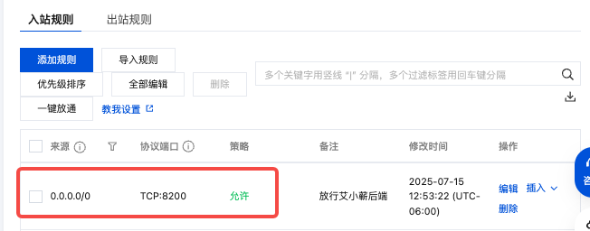
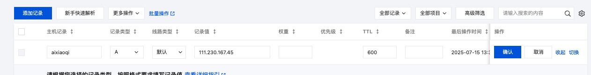
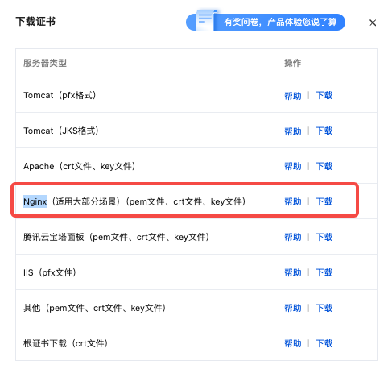

# 开发信息记录

## 运行代码
### 直接运行
```bash
# 本地
#设置环境变量
export WEAPP_APPID=xxx
export WEAPP_APPSECRET=xxx
export Jwt_SECRET=xxx
export OSS_ACCESS_KEY_ID=xxx
export OSS_ACCESS_KEY_SECRET=xxx
export AI_APPCODE=xxx

# 运行
go run main.go server -c config/settings.yml
````
### 暂停之前的docker container
```bash
# 本地
docker compose down #停止并移除旧容器

docker images               # 找到 a ixiaoqi-server:latest 的 IMAGE ID
docker rmi <IMAGE_ID>  #删除旧的docker镜像
````
### 运行最新代码（要docker运行，因为含有enn文件）
```bash
# 本地
GOOS=linux GOARCH=amd64 go build -o go-admin main.go #构建新的可执行文件

docker build -t aixiaoqi-server:latest . #构建新的docker镜像
docker compose up #执行docker-compose文件
````

---------------------------------
## 备注信息
* 创建新表后，手动创建数据库
```bash
# sql参考代码
CREATE TABLE `article` (
                           `id` int(11) unsigned NOT NULL AUTO_INCREMENT COMMENT '编码',
                           `title` varchar(128) DEFAULT NULL COMMENT '标题',
                           `author` varchar(128) DEFAULT NULL COMMENT '作者',
                           `content` varchar(255) DEFAULT NULL COMMENT '内容',
                           `status` int(1) DEFAULT NULL COMMENT '状态',
                           `publish_at` timestamp NULL DEFAULT NULL COMMENT '发布时间',
                           `created_at` timestamp NULL DEFAULT NULL,
                           `updated_at` timestamp NULL DEFAULT NULL,
                           `deleted_at` timestamp NULL DEFAULT NULL,
                           `create_by` int(11) unsigned DEFAULT NULL,
                           `update_by` int(11) unsigned DEFAULT NULL,
                           PRIMARY KEY (`id`),
                           KEY `idx_article_deleted_at` (`deleted_at`) USING BTREE
) ENGINE=InnoDB AUTO_INCREMENT=1 DEFAULT CHARSET=utf8mb4 COMMENT='文章';
````
* app/admin 中后台接口
* app/wechat 微信端接口
* config/settings.yml 使用的配置文件
* secrets.txt 文件用于消除git中的“秘密”信息（不消除不让上传到git）
  (git filter-repo --force --replace-text secrets.txt)
* 微信登录token有效期，在config/setting.yml中设置

---------------------------------
## 开发环境
* 腾讯云: youkang1988@163.com
* 服务器：区块链系统(111.230.167.45)
* 路径：/opt/go-admin

------
## 更新服务
### 本地代码上传到git（如果docker相关文件更新）
```bash
# 本地
git push -u origin main
````
### 更新本地“.env”文件到服务器（如果.env文件更新）
```bash
# 本地
scp .env root@111.230.167.45:/opt/go-admin
````
### 链接服务器
```bash
# 本地
ssh root@111.230.167.45
````
### 服务器更新代码（如果docker相关文件更新）
```bash
# 服务器
cd /opt/go-admin
git pull
````
### 上传新的docker image(确保本地的docker在运行)
```bash
# 本地
# 构建新的可执行文件
GOOS=linux GOARCH=amd64 go build -o go-admin main.go 
# 在 M1/M2 上构建 amd64 镜像并直接输出成 tar 文件
docker buildx build \
  --platform linux/amd64 \
  -t aixiaoqi-server:latest \
  --output type=docker,dest=./aixiaoqi-server.tar \
  .
# 上传到服务器
scp aixiaoqi-server.tar root@111.230.167.45:/opt/go-admin
````
### 删除旧的服务
```bash
# 服务器
cd /opt/go-admin
docker compose down #停止并移除旧容器

docker images               # 找到 a ixiaoqi-server:latest 的 IMAGE ID
docker rmi aixiaoqi-server:latest  #删除旧的docker镜像
````
### 重启docker container
```bash
# 服务器
docker load -i aixiaoqi-server.tar
docker image ls #查看image列表
docker compose up -d #执行docker-compose文件
docker logs -f aixiaoqi-server #查看docker记录
````
---------------------------------
## 首次部署开发环境
### 服务器编译服可执行文件（方面后续更新代码）
1. 连接服务器（服务器已经配置了SSH密钥，无需输入密码）
```bash
# 本地
ssh root@111.230.167.45
```
2. git下载代码 (国内服务器通过https下载代码会被墙，可以使用ssh的方式，需要在服务器设置好SSH key（ssh-keygen -t ed25519 -C "your_email@example.com"
  ），然后把公钥（cat ~/.ssh/id_ed25519.pub）复制到github设置ssh的页面（https://github.com/settings/keys）)
```bash
# 服务器
cd /opt
git clone git@github.com:FeiyangTan/go-admin.git
````
3. 同步git管理的以外文件".env"用于标注环境变量
```bash
# 本地
scp .env root@111.230.167.45:/opt/go-admin
````
4. 下载go（如果服务器没有go，go版本不对要删除原来go的版本）
```bash
# 服务器
  cd /tmp
  wget https://golang.google.cn/dl/go1.24.5.linux-arm64.tar.gz
  
```
5. 编译go可执行文件
```bash
# 服务器
cd /opt
go mod tidy
GOOS=linux GOARCH=amd64 go build -o go-admin main.go
```
### 服务器docker运行服务
1. 本地构建镜像（适用于服务器linux/amd64的image）（服务器构建不了docker image，大陆网络墙）
```bash
# 本地
# 设置buildx(只需设置一次)
docker buildx create --use --name amd64builder
```
* 如果之前已经设置过了（切换buildx模式） 
  * docker buildx ls #查看当前所有 buildx 实例
  * docker buildx use amd64builder # 切换到已有的 amd64builder

```bash
# 本地，在 M1/M2 上构建 amd64 镜像并直接输出成 tar 文件
docker buildx build \
  --platform linux/amd64 \
  -t aixiaoqi-server:latest \
  --output type=docker,dest=./aixiaoqi-server.tar \
  .
  
# 上传到服务器
scp aixiaoqi-server.tar root@111.230.167.45:/opt/go-admin

```
2. 服务器上运行镜像
```bash
# 服务器
cd /opt/go-admin
docker load -i aixiaoqi-server.tar
docker image ls #查看image列表
docker compose up -d #执行docker-compose文件
docker logs -f aixiaoqi-server #查看docker记录
```
3. 服务器安全设置上，打开对外的8200端口。（设置完，可以测试一下）  


### 后端添加HTTPS服务（小程序需要）
1. 配置域名，添加二级域名记录   


2. 下载https证书  


3. 服务器准备需要的目录
```bash
# 服务器
mkdir -p /opt/nginx/aixiaoqi/{conf.d,ssl}

````

4. 把https证书放到服务器上
```bash
# 本地
scp qiai.link_bundle.pem qiai.link.key root@111.230.167.45:/opt/nginx/aixiaoqi/ssl/
````

5. 新增Nginx的配置文件
```bash
# 服务器
vim /opt/nginx/aixiaoqi/conf.d/aixiaoqi.qiai.link.conf
```
* 文件内容
```bash
# 1. HTTP 强制跳转到 HTTPS（可选）
server {
listen      80;
server_name aixiaoqi.qiai.link;
return      301 https://$host$request_uri;
}

# 2. 正式的 HTTPS 服务
server {
listen              443 ssl http2;
server_name         aixiaoqi.qiai.link;

    # 证书和私钥路径
    ssl_certificate     /etc/nginx/ssl/qiai.link_bundle.pem;
    ssl_certificate_key /etc/nginx/ssl/qiai.link.key;

    # （可选）如果你有单独的中间/根证书
    # ssl_trusted_certificate /etc/nginx/ssl/root_and_intermediate.crt;

    # 安全优化（推荐拷进 http { } 块或这里都行）
    ssl_protocols       TLSv1.2 TLSv1.3;
    ssl_ciphers         HIGH:!aNULL:!MD5;

    # 反向代理到你的后端进程（127.0.0.1:8200）
    location / {
        proxy_pass         http://host.docker.internal:8200;
        proxy_http_version 1.1;
        proxy_set_header   Host              $host;
        proxy_set_header   X-Real-IP         $remote_addr;
        proxy_set_header   X-Forwarded-For   $proxy_add_x_forwarded_for;
        proxy_set_header   X-Forwarded-Proto $scheme;
    }
}
````
6. 用docker启动nginx
```bash
# 服务器 
docker run -d --name aixiaoqi-https \
  --add-host host.docker.internal:host-gateway \
  -p 80:80 \            # 如果你还想保留 http->https 重定向
  -p 443:443 \
  -v /opt/nginx/aixiaoqi/conf.d:/etc/nginx/conf.d:ro \
  -v /opt/nginx/aixiaoqi/ssl:/etc/nginx/ssl:ro \
  nginx:latest
````


